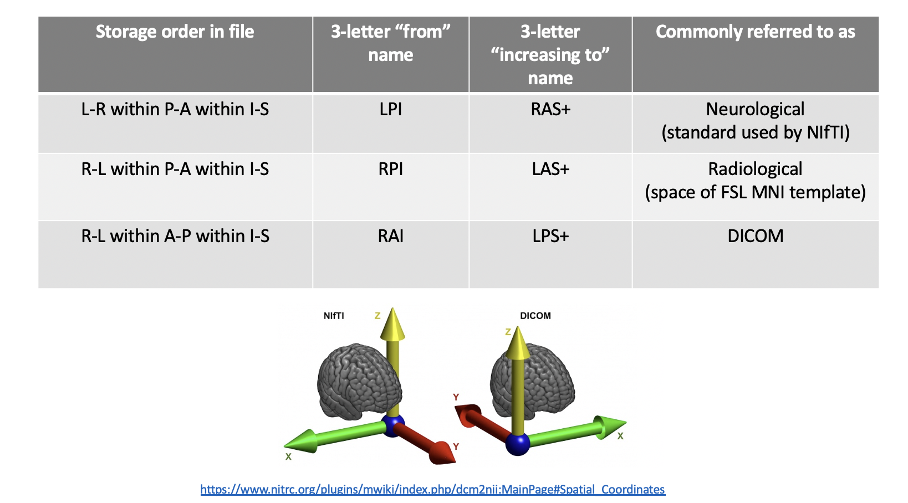
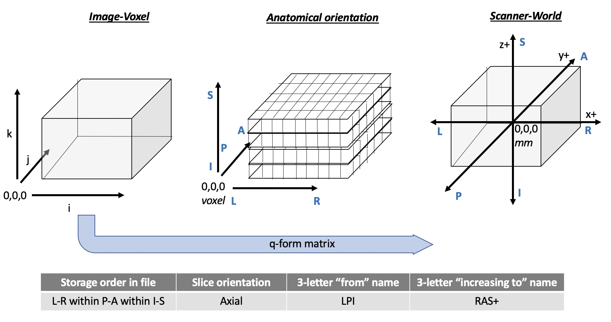

The purpose of this lab is to understand the basics of how images are stored and get hands-on practice interacting with images and the meta-data in their headers through the command line. 

**By the end of this practical you should be able to:**  
* [ ] understand the difference between image-voxel and scanner-world coordinates   
* [ ] recognize nifti files and access their header data with `fslinfo` and `fslhd`  
* [ ] use header data to describe anatomical image resolution: field of view, matrix size, slice thickness, voxel dimensions  
* [ ] use header data to identify image orientation   
 

**Access FastX** through the remote login:  
https://fastx.divms.uiowa.edu:3443/   
 

**Download lab assignment questions**:  
[Lab 2 assignment doc](https://www.dropbox.com/s/6mmzh8dev3dnesy/Lab-02_questions.docx?dl=0)

**Download our data for today**:  
*  Open the terminal
*  Change directories from your home directory to `fmriLab` with the command: `cd fmriLab`
*  To download data, copy/paste to the terminal `wget -O ds005.tar.gz https://www.dropbox.com/s/a3xsd5svookh6f9/ds005.tar.gz?dl=0`
*  To unpack your download copy/paste `tar -xvf ds005.tar.gz`
*  Move yourself into the folder with data by typing `cd ds005`
*  Note, the example data includes one subject from this [dataset](https://openneuro.org/datasets/ds000005/versions/00001) shared on the public repository OpenNeuro
 

 

**Introduction to two coordinate spaces for our MR images:**  
* **Image-voxel space**
  * Think of this as image storage space with voxels as our 3-dimenstional pixels that are our spatial unit of measurement for intensity values in the image. The coordinate origin of this space is (i,j,k)=0,0,0, positioned in the corner of the image as the initial index for storage of data in a matrix, where all values are positive and refer to the location of the mid-point of each whole voxel that will be given an image intensity value.
* **Scanner-world space**
  * Think of this as our destination space for our measurements of the brain, where we have mapped the image to the object as positioned in the physical world of the scanner using common scientific units of distance such as millimeters (mm). The coordinate origin of this space is (x,y,z)=0,0,0, positioned near the center of the image bounding box for subject-space and at a specific anatomical landmark near the center of the brain for standard-space (e.g., anterior commissure), so there will be both negative and positive values in this coordinate space.
 
 

**The table below summarizes common coordinate spaces in MRI/fMRI, with anatomical labels and common terms for referencing image orientation:**
    
 
 

**The figure below visualizes voxel and world space in the LPI/RAS+ orientation that NIfTI images are reconstructed to:**  
    
 

**`Summarize the differences between scanner anatomical and voxel coordinates in question 1 of your Lab 02 assignment`**
 

**Now let's look at how we access this information within an image header**:  
* Go back to the terminal, and move yourself to where the T1 image is in our lab data set. 
  * `cd ~/fmriLab/ds005/sub-01/anat`
  * see what is here by typing `ls`
* Use the command-line tool `fslhd` to see the meta-data for the T1 image
  * see usage by typing `fslhd` in the terminal
* Make a text file of the header contents by redirecting the output of the command to a text file
  * Copy/paste into the terminal: `fslhd sub-01_anat_sub-01_T1w.nii.gz > sub-01_anat_sub-01_T1w_header-annotated.txt`
  * Open the text file with gedit: `gedit sub-01_anat_sub-01_T1w_header-annotated.txt`
* In breakout groups
  * Use the NIfTI reference links from our readings for today to comment in annotations for the following lines in the header:
    * Lines 4 through 8
    * Lines 17 through 21
    * Lines 45 through 62
    * Pick someone in your group who's willing to share your group's answers 
  * Draw the image space as a cube with labels for the following information:
    * Size of the matrix for a slice (hint it's square)
    * Slice thickness and orientation
    * Voxel size
    * Pick someone in your group who's willing to share their drawing

**Use what you've learned to inspect the header for the fMR image**:  
* Go back to the terminal, and move yourself to where the functional image is in our lab data set. 
  * `cd ~/fmriLab/ds005/sub-01/func`
  * In breakout groups
    * Compare and contrast the image data for lines we've annotated above
      * How does the slice orientation differ?
      * How many volumes are in the functional image?
      * How does the voxel size differ?
      * What is the time of repetition (TR) for each volume?
      * How does the image orientation differ?
  * Draw the image space as a cube with labels for the following information:
      * Size of the matrix for a slice (hint it's square)
      * Slice thickness and orientation
      * Voxel size
      * Pick someone in your group who's willing to share their drawing

**`Summarize what you've learned by answering questions 2 and 3 of your Lab 02 assignment`**
 
