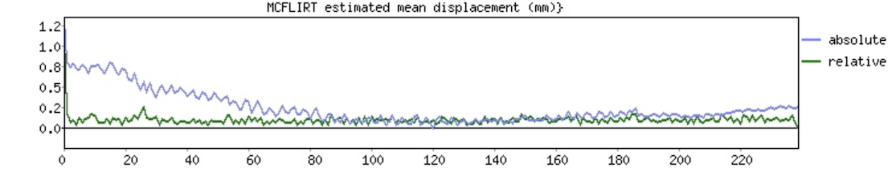
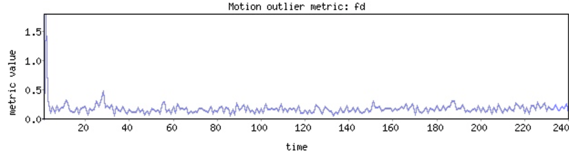
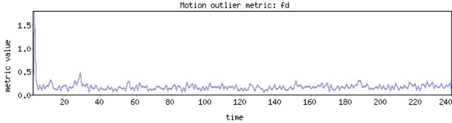
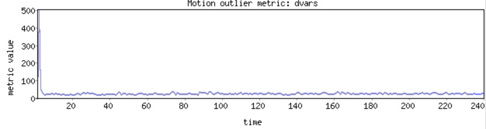

**Motion detection and correction**
</br>
The purpose of this lab is to practice correcting for volume-to-volume motion in a functional MR image, and to learn about common correction parameters and how to describe them with numbers and figures.
</br>


**By the end of this practical you should be able to:** <br/>
* [ ] use FSL's [mcflirt](https://fsl.fmrib.ox.ac.uk/fsl/fslwiki/MCFLIRT) tool to run motion correction 
* [ ] use FSL's [fsl_motion_outliers](https://fsl.fmrib.ox.ac.uk/fsl/fslwiki/FSLMotionOutliers) tool describe motion in funcitonal MRI data <br/>
* [ ] interpret the output of FSL's motion detection and correction tools 
* [ ] interpret the output of [mriqc](https://mriqc.readthedocs.io/en/stable/) for assessing motion


**Access FastX** through the remote login: <br>
https://fastx.divms.uiowa.edu:3443/  <br/>
<br/>


**Lab data** <br>
We will continue working with the data from our mixtape directories.


**Step 1: Prepare a new derivatives directory for motion correction**
* Move yourself to the `~/fmriLab/bold_image-mixtape/` directory
* At the terminal, type: `mkdir sub-2801_mc`
 </br>

**Step 2: Run motion correction**
Using the code below, make a bash script called `run_mcflirt.sh` to run motion correction, and run it to produce motion correction output. I will also send a copy of the script out on slack.<br>
* suggest to use VS Code editor
* to make a new file or edit an existing file: `code run_mcflirt.sh`
    * notice some new tricks for the code in the script:
        * define the directory where our EPI (functional, bold) data exist (`epiDir`)
        * define the input volume as a variable named `invol`
            * how can this be used later in the script?
            * why would we do this?
        * define the output of a command as a variable
            * find one example
        * expression of variables within `echo` commands
            * find one example
        * check if a file exists using an `if-then` statement

```
#!/bin/bash

sub='2801'
epiDir=~/fmriLab/bold_image-mixtape
cd ${epiDir}/sub-${sub}_mc
invol=${epiDir}/sub-${sub}_task-rest_bold

echo "Determining middle volume in functional series"

halfPoint=$(fslhd "${invol}.nii.gz" | grep "^dim4" | awk '{print int($2/2)}')
echo "Middle volume is $halfPoint"

# check if .mat directory output exists and if so delete it
if [ -d ${invol}*.mat ]
	then 
		echo "cleaning up existing .mat file output" 
		rm -R ${invol}*.mat
	else
		echo "no existing .mat file detected (OK)"
fi
	

echo "Running MCFLIRT motion correction"

# Run mcflirt
mcflirt -in ${invol}.nii.gz \
-out sub-${sub}_proc-mcf \
-cost normcorr \
-refvol ${halfPoint} \
-plots \
-stats \
-rmsrel -rmsabs -spline_final


echo "Making plots of rotations, translations, and displacements"

# Plot rotations (radians)
fsl_tsplot -i sub-${sub}_proc-mcf.par \
-t 'MCFLIRT estimated rotations (radians)' \
-u 1 --start=1 --finish=3 -a x,y,z -w 640 -h 144 -o mot_rot.png

# Plot translations (mm)
fsl_tsplot -i sub-${sub}_proc-mcf.par \
-t 'MCFLIRT estimated translations (mm)' \
-u 1 --start=4 --finish=6 -a x,y,z -w 640 -h 144 -o mot_trans.png

# Plot volume displacement. Abs=relative to reference vol. Rel=relative to vol n-1.
fsl_tsplot -i sub-${sub}_proc-mcf_abs.rms,sub-${sub}_proc-mcf_rel.rms \
-t 'MCFLIRT estimated mean displacement (mm)}' \
-u 1 -w 640 -h 144 -a absolute,relative -o mot_disp.png

echo "MCLFIRT script done and plots saved"


# Compute and plot frame-wise displacement as computed by Power et al., 2012
fsl_motion_outliers -i ${invol}.nii.gz \
-o sub-${sub}_mot_confounds-fd \
--fd -s sub-${sub}_mot_fd-ts.txt -p sub-${sub}_mot_fd-plot 
# use awk to compute mean of single column
fd_mean=$(awk '{ total += $1; count++ } END { print total/count }' sub-${sub}_mot_fd-ts.txt)


# Compute and plot frame-wise displacement as computed by Jenkinson et al., 2002
fsl_motion_outliers -i ${invol}.nii.gz \
-o sub-${sub}_mot_confounds-fdrms \
--fdrms -s sub-${sub}_mot_fdrms-ts.txt -p $sub-${sub}_mot_fdrms-plot 
# use awk to compute mean of single column
fdrms_mean=$(awk '{ total += $1; count++ } END { print total/count }' sub-${sub}_mot_fdrms-ts.txt)


# Compute and plot frame-wise displacement as computed by Power et al., 2012
fsl_motion_outliers -i ${invol}.nii.gz \
-o sub-${sub}_mot_confounds-dvars \
--dvars -s sub-${sub}_mot_dvars-ts.txt -p sub-${sub}_mot_dvars-plot 
# use awk to compute mean of single column
dvars_mean=$(awk '{ total += $1; count++ } END { print total/count }' sub-${sub}_mot_dvars-ts.txt)


# Report motion descriptives to terminal
abs_mean=`cat sub-${sub}_proc-mcf_abs_mean.rms`
echo "Mean absolute head displacement was ${abs_mean}"

rel_mean=`cat sub-${sub}_proc-mcf_rel_mean.rms`
echo "Mean relative head displacement (Jenkinson et al., 2002) was ${rel_mean}"
echo "This should match mean fdrms (mm) as ${fdrms_mean}"

echo "Mean FD (Power et al., 2012) was ${fd_mean}"

echo "Mean DVARS (Power et al, 2012) was ${dvars_mean}"
```


**Step 3: View motion trace plots to interpret to assess severity of head motion**

**A. Interpretation of motion displacement estimates** </br>

**Jenkinson et al., 2002** [pdf](https://www.dropbox.com/s/4da5lpor1wbkh9i/Jenkinson-2002-Improved%20Optimization%20for%20the%20R.pdf?dl=0)
* Differentiating head realignment parameters across frames yields a six dimensional timeseries that represents instantaneous head motion. 
* Rotational displacements are converted from degrees to millimeters by calculating displacement on the surface of a sphere of radius 80 mm.
* Takes into account the range of voxel displacements over the sphere by computing the root-mean-square (with mean across all intracerebral voxels) of translation (mm) of the voxels before sphere model.
* This can be output from `mcflirt` with the `-rmsrel` flag, which matches the relative displacement (mm) trace shown together with the absolute displacement as estimated from our `mcflirt` call. This is the same variable referred to as `fdrms` computed by `fsl_motion_outliers`. Compare their traces below:</br>


</br>


</br>

**Power et al., 2012** [pdf](https://www.dropbox.com/s/v4vsop6i4g8xf9h/PowerNeuroImage2012.pdf?dl=0)
* Rotational displacements are converted from degrees to millimeters by calculating displacement on the surface of a sphere of radius 50 mm.
* Assumes that all voxels undergo equivalent displacements along the sphere in response to a given rotation.
* These tend to be about twice as large as the Jenkinson estimates, and we indeed replicate this trend as shown by the trace below: </br>

</br>

**TIP!** <br>
You can open a set of `.png` files from the terminal with a `loop` command like this: <br>
```
for p in mot_*.png; do eog "$p";done
```
</br>

**B. Interpretation of FSL-derived volume-to-volume bold intensity estimates** <br> 
* `DVARS` is the root-mean-square intensity difference of volume N to volume N+1 as proposed by Power et al., 2012. This quantifies the rate of volume-to-volume change in the BOLD signal. Higher values indicate more instances of rapid changes in BOLD signal intensity, which is an indicator of more volumes corrupted by motion. So higher is bad.
* Think of this as an intensity-based metric that matches the FD volume-displacement based metric shown above. For higher motion subjects when the quality of motion correction is highly variable, then an intensity based estimate could be more reliable.</br>


</br>

**C. Interpretation of output and motion plots** </br>
* Why might motion estimates be off for our first couple volumes?
* What is a source of bias in our plots? e.g., is our DVARS an accurate depiction of only motion related changes in BOLD?
    * could you imagine how this property of DVARS is useful if we didn't know there were dummy scans or how many to exclude?
* Let's see how we could use `fslroi` to prepare our functional image for more accurate motion correction
    * modify your script to run on the newly prepped functional image
* What would be one way to improve our script for good documentation of output?


