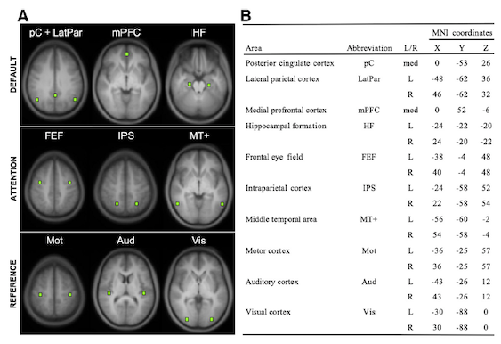
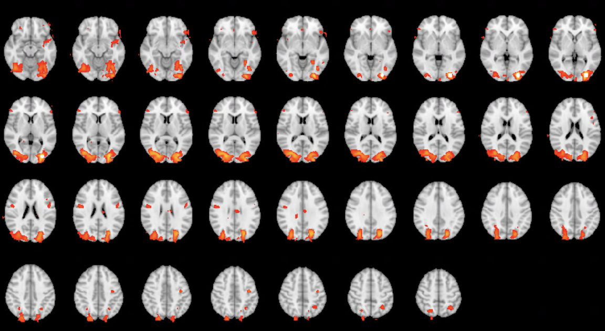
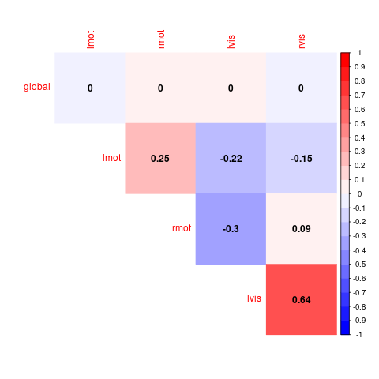

**Resting State Functional Connectivity**
 
The purpose of this lab is to walk through key steps of data processing for resting state functional connectivity analyses. The lab is built to emphasize understanding several key steps rather than a how-to of running one of many possible software packages that run these steps start to finish.

 

**By the end of this practical you should be able to:**  
* [ ] understand the basic preprocessing steps to prepare data for functional connectivity analyses
* [ ] understand what a nuisance regression is  
* [ ] understand the difference between a functional connectivity map and a functional connectivity matrix 

**Access FastX** through the remote login:  
https://fastx.divms.uiowa.edu:3443/   
 

**Download lab assignment questions**:  
[Lab 12 assignment doc](https://www.dropbox.com/s/jazysm4np0oqweb/Lab-12_questions.docx?dl=0)  
 

**Lab data**  
We will download new data that includes resting state BOLD data from one participant:
* cd to fmriLab: `cd ~/fmriLab`
* download data: `wget -O restingState.tar.gz https://www.dropbox.com/s/vqemwf91buhlqrd/restingState.tar.gz?dl=0`
* unpack: `tar -xvf restingState.tar.gz`
* clean-up: `rm restingState.tar.gz`

 
 

**Prerequisite: Source AFNI**
* [AFNI](https://afni.nimh.nih.gov/) is another image processing software that has handy command line functions
* see instructions [here](https://github.com/mwvoss/MRI-lab-classes/wiki/Setup-FSL-and-AFNI-in-remote-linux-environment) for setting up access to AFNI on the fastX nodes for general use

 
 

**Step 0: Prepare functional data with preprocessing (pre-baked in download)**
* **The steps listed here under Step 0 have been completed for sake of time**
    * Derivatives of the process are avaiable in case you'd like to replicate
    * Our in-class lab starts with **Step 1** below
* Move yourself to the derivatives directory where we'll put processed data: 
    * `cd ~/fmriLab/restingState/derivatives/rsOut`
* Copy unprocessed bold image here for ease to work with and it's clearly labeled as our starting raw image: 
    * `cp ~/fmriLab/restingState/sub-001/func/sub-001_task-rest_bold.nii.gz sub-001_func-raw.nii.gz`
* Preprocessing:
    * setup preprocessing only using the FEAT GUI, including creation of registration transforms 
        * `Data` tab
            * select `Preprocessing` next to the `First-level analysis` option
            * select your `sub-001_func-raw.nii.gz` image as your 4D data
            * name the output directory as a folder called `preproc_affine` within `rsOut`
            * delete the first 4 volumes, which are dummy volumes that were saved in these data
        * `Pre-Stats` tab
            * adjust smoothing to 6mm
            * turn OFF Highpass filtering
        * `Registration` tab
            * specify skull-stripped anatomical as your high-resolution input
            * specify both transforms as affine 12 DOF
                * note the result of bbr+non-linear registration is in the `preproc` directory for comparison
        * Hit `Go`
    * our preprocessed data is `preproc_affine.feat/filtered_func_data.nii.gz`
* Use registration transforms generated in last step to warp our preprocessed bold data into MNI space
    * Step usees skills and tools from this [lab](https://github.com/mwvoss/MRI-lab-classes/blob/master/PSY6280-2020-FA2020/practical_spatial-registration.md)
    * Affine spatial normalization of a functional bold image: `flirt -in preproc_affine.feat/filtered_func_data.nii.gz -ref ${FSLDIR}/data/standard/MNI152_T1_2mm_brain.nii.gz -out sub-001_func-reg.nii.gz -applyxfm -init preproc_affine.feat/reg/example_func2standard.mat`
* We now have an fMR image that has been preprocessed in the spatial dimension and only needs further filtering in the temporal dimension
* In your downloaded data, you also have an `ROIs` directory which contains left and right motor and visual ROIs from the [Van Dijk et al](https://github.com/mwvoss/MRI-lab-classes/blob/master/PSY6280-2020-FA2020/pdfs/Van%20Dijk-2010-Intrinsic%20functional%20connectivit.pdf) paper as shown in the table below. 
    * These ROIs were made with the `makeROI.sh` bash script that you can try out for making your own ROIs of a given size and shape (sphere or cube) from MNI coordinates, which is the default reference space. To try the script, move yourself in the terminal to the ROIs folder and type `bash makeROI.sh` to see usage.  

 
 
 

**Step 1: Nuisance regression**
* we'll start here during class
    * **_first let us_**: open our prepared functional data and ROIs for visual inspection and review our goals with nuisance regression
    * open our functional data in `fsleyes`: 
        * `cd /fmriLab/restingState/derivatives/rsOut`
        * `fsleyes sub-001_func-reg.nii.gz`
* extract timeseries data for nuisance regression
    * use `fslmeants` to make timeseries plots for Nuisance ROIs:
        * in the terminal, you should be in the `rsOut directory`
        * example for global: `fslmeants -i sub-001_func-reg.nii.gz -o nuisanceRegression/global_ts.txt -m ../ROIs/global.nii.gz`
        * use `fslmeants` to create timeseries for the `latvent` ROI, and name your text file `latvent_ts.txt`; repeat for the `wmroi` and name text file `wmroi_ts.txt`
    * use `fsl_tsplot` to plot the timeseries data from these files together for comparison:
        * paste or type to terminal: `fsl_tsplot -i nuisanceRegression/global_ts.txt,nuisanceRegression/latvent_ts.txt,nuisanceRegression/wmroi_ts.txt -a global,csf,wm -o nuisanceRegression/nuisanceROIs_tsplot`
    * use `paste` to stitch together columns of nuisance BOLD and 6 motion parameter regressors, from nuisanceRegression directory: `paste preproc_affine.feat/mc/prefiltered_func_data_mcf.par nuisanceRegression/global_ts.txt nuisanceRegression/wmroi_ts.txt nuisanceRegression/latvent_ts.txt > nuisanceRegression/nuisance_ts_model.txt`
* run nuisnace regression with our nuisance_ts_model as predictors of observed bold data
    * use [AFNI's `3dTproject`](https://afni.nimh.nih.gov/pub/dist/doc/program_help/3dTproject.html) to run nuisance regression with nuisance BOLD and motion regressors enterered **_simultaneously_** with regressors that carry out temporal filtering. `3dTproject` also provides options for including regressors identifying volumes to be "censored" (or scrubbed) in your timeseries.
    * paste or type to terminal: `3dTproject -input sub-001_func-reg.nii.gz -prefix sub-001_func-reg-bp-resid.nii.gz -mask ../ROIs/mask_mni.nii.gz -bandpass .008 .08 -ort nuisanceRegression/nuisance_ts_model.txt`
        * see what changed by compare timeseries data before and after nuisance regression 
        * `fsleyes sub-001_func-reg.nii.gz sub-001_func-reg-bp-resid.nii.gz`

 
 

**Step 2: Seed-to-brain correlation maps**
* extract residual (preprocessed) timeseries from the left motor cortex ROI
    * in the terminal, you should be in the `rsOut directory`
    *  `fslmeants -i sub-001_func-reg-bp-resid.nii.gz -o seedFC/lmot_resid_ts.txt -m ../ROIs/lmot.nii.gz`
* use [AFNI's `3dTcorr1D` tool](https://afni.nimh.nih.gov/pub/dist/doc/program_help/3dTcorr1D.html) to make a functional connectivity seed-to-brain map: 
    * paste or type to terminal: `3dTcorr1D -prefix seedFC/lmot_corrmap.nii.gz -pearson sub-001_func-reg-bp-resid.nii.gz seedFC/lmot_resid_ts.txt`
    * view with `fsleyes`
        * these are pearson r correlations: view histogram, what is range?
            * note when doing group analyses, it's often helpful to transform your pearson r's to Fisher's r
            * this is an option in the `3dTcorr1D` function
        * threshold the correlation map, sanity check: is the seed correlated most strongly with itself?
        * what other regions have a timeseries correlated with the seed?
    * replicate steps with the left visual ROI; below is view of my result for the left visual cortex seed, thresholded at r >.50
    

 
 

**Step 3: ROI-to-ROI correlation matrix**
* use the steps shown above to make residual timeseries files for the right motor cortex and visual cortex ROIs, and the global mask ROI, and place them all in the `seedFC` directory
* change directories to where your residual timeseries data are: `cd seedFC`
* use `paste` to make a text tile with all the timeseries data entered as columns: 
    * `paste global_resid_ts.txt lmot_resid_ts.txt rmot_resid_ts.txt lvis_resid_ts.txt rvis_resid_ts.txt > rois_resid_ts.txt`
* use supplied `plot_roicorr.R` script to compute correlation matrix and plot as a heat-map
    * at terminal: `Rscript plot_roicorr.R`
    * the result should a `.png` file named `roicorr_heatmap.png` that looks like below:

 
 

**Discussion questions:**
* is it surprising that the correlation of each ROI of interest is 0 with the global signal?
* compare the within-system functional connectivity (fc) of the motor and visual systems
* how does within- and between- system fc compare with expectations? 
* are within- and between- system differently related to the global signal used in nuisance regression?
* how could we do group analyses with the seed-maps? (hint: think about pearson or fisher's maps like copes from our task analysis)
* how could we do group analyses with the ROI-to-ROI correlation matrices? 

