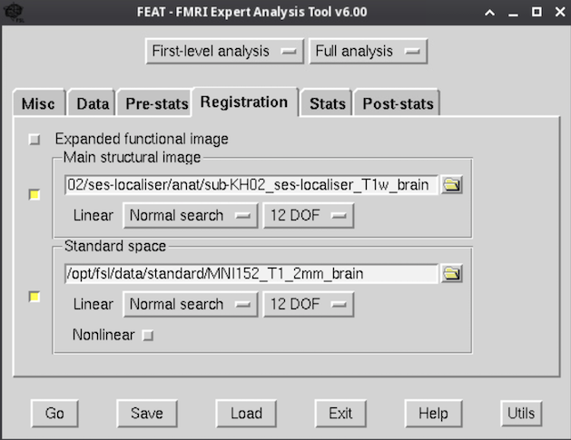

**By the end of this practical you should be able to:**  
* [ ] specify preprocessing for task-related BOLD signal in the FEAT GUI  
* [ ] create and understand a model of task-related BOLD signal in the FEAT GUI  
* [ ] understand how to test for activation differences between conditions  
* [ ] locate and load FEAT design files in the GUI  
* [ ] understand how to use a script to search and replace subject and run identifiers in the .fsf files  
 

**Access FastX** through the remote login:  
https://fastx.divms.uiowa.edu:3443/   
 

**Download lab assignment questions**:  
[Lab 9 assignment doc](dropbox link)  
 

**Lab data**  
* We will work with three participants from this shared dataset on OpenNeuro: https://openneuro.org/datasets/ds003342/versions/1.0.0
    * To stay within our data storage limits for our class server, I have prepped the data to include only the ses-localizer block design from three participants
* In the terminal, move to the fmriLab directory: `cd ~/fmriLab`
* Copy/paste the following to your terminal to download the `ds003342` directory: `wget -O ds003342.tar.gz https://www.dropbox.com/s/ynskaifrexl61xq/ds003342.tar.gz?dl=0`
* To unzip in the terminal: `tar -xvf ds003342.tar.gz`
* To remove `tar.gz` file: `rm ds003342.tar.gz`
* Let's look at what is here
    * structure of the data in bids
        * anat and func directories
        * multiple runs per subject
    * event onsets
 

* **Step 1: Open FEAT GUI** to start task model setup
    * In the terminal, move to the root directory for our ds003030 dataset: `cd ~/fmriLab/ds003342/` 
    * In the terminal, type `fsl` to bring up the GUI
    * click on `FEAT FMRI analysis`

 

* **Data tab**
    * Click `Select 4D data` and select the full path to our initial functional image `~fmriLab/ds003342/sub-KH02/ses-localiser/func/sub-KH02_ses-localiser_task-localiser_run-01_bold.nii.gz`
    * Select the participant's directory within the derivatives/feat directory as your `Output directory` and name your output directory for this run as `feat_run-01.feat`
    * A `Highpass` temporal filter will let high frequency signals pass through and filter out frequencies lower than the filter setting. The setting here specifies the duration in seconds for one full cycle of a given task condition to occur, and frequencies `any lower` will be removed.
        * Let's look at event Onsets to see if 100 seconds would work...
    * Example of completed setup: 
    

 

* **Pre-stats tab**
    * Keep `MCFLIRT` on for motion correction
    * Keep slice timing set as `None`
    * Keep `BET brain extraction` on with selection box shown as yellow
    * Keep spatial smoothing at `5 mm` FWHM
    * Keep intensity normalization as `off`
    * Keep `Highpass` set as on
    * Keep `MELODIC ICA` set as off for sake of time 
    * Example of completed setup:  
    
 

* **Registration tab**
    * Select `Main structural image` and select our skull-stripped T1 image as input
    * Keep the `MNI152_T1_2mm_brain` image as our standard space reference
    * For purposes of speed to prioritize focus on setting up the first-level model and viewing results
        * Change the registration of the `Main image` to `12 DOF`
        * Keep `Nonlinear` registration turned off
    * Example of completed setup:  
    
 

* **Stats tab**
    * Keep `FILM prewhitening` on
    * Keep `Don't Add Motion Parameters` on
    * Keep `Add additional confound EVs` off
    * Click `Full Model setup`
        * Specify `EV1` as the `bodies` stimulus
            * Change `Basic Shape` from `Square` to `Custom (3 column format)`
            * Select onset task timing file for the `bodies` stimulus created above
            * Set `Convolution` to `Double Gamma` and leave the HRF parameter settings
            * Keep `temporal derivative` on and applied
            * Example:  
            
        * Specify `EV2` as the `chairs` stimulus
            * Replicate settings for EV1
            * Use task timing file for music stimulus
        * Specify `EV3` as the `hands` stimulus
        * Specify `EV4` as the `tools` stimulus
        * Specify `EV5` as the `scrambled` stimulus
        * We leave the baseline fixation as `unmodeled` 
        * Contrasts & F-tests tab
            * Our simplest contrast is to compare each category to the scrambled images
            * Are there other contrasts of interest?
            * An F-test tests an `OR` conditional across conditions (e.g., we may be interested in where there is activation for C1 OR C2 OR C3 OR C4)
            * These contrasts would be set as shown below:  
            
           
        
 

* **Post-stats tab**
    * Keep all default settings on
    * We will come back to statistical thresholding for group-level analysis 

 

* **Click Go**. When it's finished, the results will appear within your feat directory. 
    * Your html report will then include output of brain activation maps as previewed below. 
    * We will walk through the contents of the report in class.  
    

 

* **Step 2: Run FEAT for all subjects and runs**
    * Do you need to use the GUI to set this up again?  You could but you don't have to...
    * Let's look in the directory `~fmriLab/ds003342/code/design_files/` directory 
        * Look at `design_template.fsf`
            * Do we need to modify it?
        * Look at `make_designFiles.sh` to see how we can use this template `.fsf` file to create new set up files for more subjects and runs
            * Modify if needed and run the script to regenerate your `.fsf` files
        * Load two random `.fsf` files to see that the subject and run information populated
        * Open `run_designFiles.sh` and modify to run FEAT using the script
            * If you want to run with our `sublist_n3.txt` file you will just get a `.feat+` folder for the first participant's `run-01`. This is fine though I suggest removing the directory so you don't have directories ending in `+`!

 
 

**Lab assignment**
* Complete FEAT analyses for all the runs for subjects all three subjects 
* For all subjects, `bet` has already been run, and the T1w_brain is in the subject/anat directory

 
