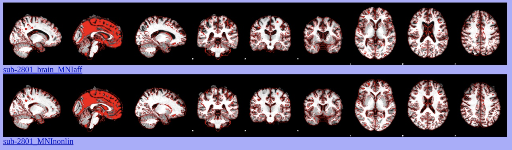

**Spatial normalization**
</br>
The goal of this lab is to learn the basic process of spatial normalization for a T1 anatomical image, and practice checking alignment between images in fsleyes.
</br>

**By the end of this practical you should be able to:** <br/>
* [ ] use FSL's [flirt](http://web.mit.edu/fsl_v5.0.10/fsl/doc/wiki/FLIRT(2f)UserGuide.html) tool to perform affine registration on a T1 image <br/>
* [ ] understand how to view and interpret the resulting affine transformation matrix <br/> 
* [ ] use FSLeyes and contour overlays to check the alignment of your T1 image to the MNI standard brain <br/> 
* [ ] for your lab homework you will complete running FSL's [fnirt](https://fsl.fmrib.ox.ac.uk/fsl/fslwiki/FNIRT) on the command-line and compare your results to affine registration
<br/>

**Access FastX** through the remote login: <br>
https://fastx.divms.uiowa.edu:3443/  <br/>
<br/>

**Lab data** <br>
We will continue working with the T1 images from the T1 mixtape directory


**Step 1: Create a directory for registration output**
    * cd `~/fmriLab/T1w_image-mixtape_proc-defaced`
    * let's start with sub-2801: `mkdir sub-2801_reg`
</br>

**Step 2: Create a prerequisite brain mask** <br>
* Use `bet` to extract the brain from non-brain and save a mask of brain space
    * Find usage instructions for `bet` by typing `bet` in your terminal
    * Use the usage to decode what the following commands are doing:
        * good for most T1w's: `bet sub-XXX.nii.gz sub-XXX_reg/sub-XXX_brain.nii.gz -R -f 0.4 -g 0 -m`
        * optimised for sub-2801: `bet sub-2801.nii.gz sub-2801_reg/sub-2801_brain.nii.gz -R -f 0.2 -g -.4 -m`    
    * Inspect the mask in with `fsleyes`:
    `fsleyes sub-2801.nii.gz sub-2801_reg/sub-2801_brain_mask.nii.gz`
    * Linear registration with `flirt` takes the skull-stripped image as input, which for sub-2801 as example is the image named `sub-2801_brain.nii.gz`
</br>


**Step 3: Understand FLIRT options with the GUI** <br>
* Open FSL at the command-line: `fsl &`
* Click on the `FLIRT linear registration` button
* Our initial options:
    * Mode: keep default as 2-stage registration
    * Reference image: use file browswer to pick the MNI standard of choice
    * Model/DOF: look at options, relate to lecture, what are the transformations allowed in the 12 parameter model?
    * Input image: use file-browser to specify our skull-stripped T1 image `sub-2801_brain.nii.gz`
    * Output: name as follows in the same directory `sub-2801_brain_MNIaff.nii.gz`
    * Advanced options:
        * Search: check options, what do we want? 
        * Cost function: `correlation ratio` is preferred for inter-modal and `normalised correlation` is preferred for intra-modal. 
        * Interpolation: `trilinear` is good option for affine image registration
    * Press `Go`
    </br>

* You should now see everything we specified in the terminal. Often when learning a new tool or trying different options, it can be helpful to use the GUI and then document your iterations with the code reference. Then when you have a good solution for your data, you can use scripting to automate the process for speed and reproducibility. For example, below is how you would run the steps we selected on the command-line. The backward slash allows you to continue the command in a new line, which can help with seeing what options are specified for each argument. </br>

    ```
    flirt -in ~/fmriLab/T1w_image-mixtape_proc-defaced/sub-2801_reg/sub-2801_brain.nii.gz \
    -ref $FSLDIR/data/standard/MNI152_T1_1mm_brain \
    -out ~/fmriLab/T1w_image-mixtape_proc-defaced/sub-2801_reg/sub-2801_brain_MNIaff.nii.gz \
    -omat ~/fmriLab/T1w_image-mixtape_proc-defaced/sub-2801_reg/sub-2801_brain_MNIaff.mat \
    -bins 256 \
    -cost normcorr \
    -searchrx -90 90 -searchry -90 90 -searchrz -90 90 \
    -dof 12  \
    -interp trilinear
    ```

</br>

* What does `omat` refer to?
    * This is the affine transformation matrix summarizing the transform from native to standard space that was just completed.
    * View in the terminal by typing: `cat sub-2801_brain_MNIaff.mat`
    * This is your `recipe` for moving in reverse from MNI to T1 native space, or for applying this same transform to another image. This affine transform can also form as the starting point for non-linear registration with FNIRT.</br>


**Step 4: Check output in FSLeyes and contour overlays** <br>
* Open our registered T1 with our MNI template:
    * `fsleyes -std1mm sub-2801_brain_MNIaff.nii.gz`
    * Start at the origin for world coordinates: 0,0,0
        * Turn cross-hairs on
        * Use opacity control to flicker between images and check alignment
        * Move through landmarks of CSF/white matter/gray matter edges from center out to gyri in each lobe. 
        * How is alignment overall? Problem areas?
    * For more static documentation of alignment, use FSL's `slicesdir` program to create a png file of axial slices showing your spatially normalized T1 image with the MNI template as a red contour overlay:
`slicesdir -p $FSLDIR/data/standard/MNI152_T1_1mm_brain.nii.gz sub-2801_brain_MNIaff.nii.gz`
        * View the .png file of the overlay in the `slicesdir` directory
        * View a list of overlays in the `index.html` folder

* What if you think it could be better?
    * [FLIRT FAQs](https://fsl.fmrib.ox.ac.uk/fsl/fslwiki/FLIRT/FAQ)


**Step 5: Refine with non-linear registration using FNIRT** <br>
* After an initial affine registration, better local alignment can often be achieved with non-linear registration.
* Below shows how to run `FNIRT` on the command-line from the `sub-2801_reg` directory:

```
fnirt --iout=sub-2801_MNI_head --in=../sub-2801.nii.gz \
--aff=sub-2801_brain_MNIaff.mat \
--cout=sub-2801_MNI_warp --iout=sub-2801_MNInonlin \
--jout=sub-2801_MNI_jac \
--ref=MNI152_T1_1mm.nii.gz --refmask=MNI152_T1_1mm_brain_mask_dil.nii.gz \
--warpres=10,10,10
```

* FNIRT can take some time, when it is finished: 
    * check your alignment: `fsleyes -std1mm sub-2801_MNInonlin.nii.gz` 

* You can now apply your non-linear warp to your skull-stripped T1 with `applywarp`:
```
applywarp -i sub-2801_brain.nii.gz \
-r $FSLDIR/data/standard/MNI152_T1_1mm_brain \
-o sub-2801_MNInonlin.nii.gz \
-w sub-2801_MNI_warp.nii.gz
```

* Check your alignment and compare to affine: `fsleyes $FSLDIR/data/standard/MNI152_T1_1mm.nii.gz sub-2801_brain_MNIaff.nii.gz sub-2801_MNInonlin.nii.gz` 

* Add your new non-linear result to your list of overlays comparing alignment with FSL's `slicesdir` program:
`slicesdir -p $FSLDIR/data/standard/MNI152_T1_1mm_brain.nii.gz sub-2801_brain_MNIaff.nii.gz sub-2801_MNInonlin.nii.gz`

</br>
You should now see an overlay for both the affine and non-linear registrations: 



