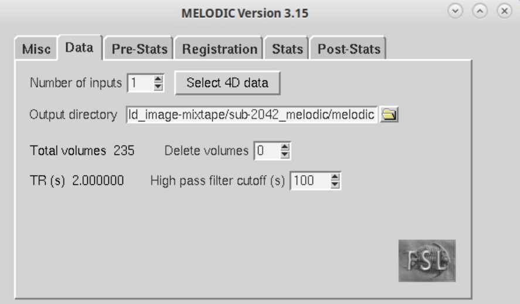

**Spatiotemporal denoising with independent component analysis** 
 

The purpose of this lab is to get hands-on experience interpreting the output of spatial independent component analysis as run in FSL's MELODIC program, with emphasis on labeling components to denoise fMRI data. The experience of manual labeling will help help you become familiar with the various sources of noise in fMRI data even after standard preprocessing, and will help you appreciate when and how to apply ICA approaches that are a blend of manual and automatic component classification (e.g., FSL's FIX) or fully automated with tuning to specific types of noise (e.g., ICA-AROMA for motion). 

 

**By the end of this practical you should be able to:**  
* [ ] interpret motion timeseries plots
* [ ] interpret the output of FSL's [MELODIC](https://fsl.fmrib.ox.ac.uk/fsl/fslwiki/MELODIC) tool for a single-subject ICA analysis
* [ ] open MELODIC-estimated components within [fsleyes's melodic scene](https://open.win.ox.ac.uk/pages/fsl/fsleyes/fsleyes/userdoc/ic_classification.html)
* [ ] understand the process of manually labeling components as signal or noise using a conservative "innocent until proven guilty" criteria such as outlined in [Griffanti et al., 2017](https://github.com/mwvoss/PSY6280/blob/main/pdfs/Griffanti-2017-ICA.pdf)
 

**Access FastX** through the remote login:  
https://fastx.divms.uiowa.edu:3443/   
 

**Download lab assignment questions**:  
[Lab 7 assignment doc](https://www.dropbox.com/s/frvt6aacf9js8ci/Lab-07_questions.docx?dl=0)  
 

**Lab data**  
We will continue working with the data from our mixtape directories.
 

**Step 1: Prepare a new derivatives directory for melodic output**
* Create a skull-stripped T1 image for sub-2042 if you haven't yet (Hint: default settings with -R and -f .5 and -g 0 should work)
* Move yourself to the `~/fmriLab/bold_image-mixtape/` directory
* At the terminal, type: `mkdir sub-2042_melodic`

**Step 2: Run preprocessing and ICA with Melodic** 
* Open the fsl GUI menu by typing `fsl` in the terminal
* Click on the `MELODIC` button
* Data tab
    * Click `Select 4D data` and select sub-2801's bold image with dummy volumes removed (that has not been registered)
    * Select the `sub-2801_melodic` directory as your Output directory and name the output `melodic` like shown below
    * Maintain the High Pass filter as 100s

 

* Pre-Stats tab
    * Maintain MCFLIRT with the default reference image of the middle volume
        * Check out options for `Alternative reference image`: what would be an example?
    * Maintain "BET" brain extraction as "on"
    * Change spatial smoothing to 6
    * Maintain the Highpass filter as set "on"
   

* Registration tab
    * Select a `Main structural image` and select your skull-stripped T1w image from your T1w mixtape directory
    * For the purposes of time we'll run linear registration
        * Main structural Image cost function: Set `Normal search` to `12 DOF` 
            * Why are we avoiding BBR?
            * What would we need to do to enable BBR to work better?
        * Standard space cost function: Set `Normal search` to `12 DOF` 
            * Notice we are resampling to 4mm resolution
            * This combined with spatial should help reduce impact of less than perfect alignment from affine registration 

* Stats and Post-Stats tabs
    * leave defaults on
* Click `Go`
 

**Step 3: Open the melodic web report for overview of pre-stats (motion) and melodic results** 
* Within the file browser, navigate to the `melodic.ica` directory for sub-2042 and open the `report.html` file with a web browser
* **Discussion questions**
    * `Pre-Stats` page: These motion traces should look familiar, they are what we generated for this participant in the last lab.
    * `Registration` page: You should now know what you're looking at! Any concerns?
    * `Log` page: here's where everything that was run is documented, starting with `Initialisation` you can see the initial input was the raw nifti bold image without preprocessing. What file is the input to melodic processing?
    * Finally, the main results are shown in the `ICA` page: We will talk through what you're seeing.
 

 **Step 3: Open melodic-derived components in fsleyes** 
* Now let's see how to view the component output interactively in fsleyes to support manual labeling of components as signal or noise
* In the terminal, move yourself to the `melodic.ica` output directory
* Open fsleyes with the melodic scene setting: `fsleyes --scene melodic -ad filtered_func_data.ica filtered_func_data.ica/melodic_IC.nii.gz`
* You should see something like below:  

 

* **Discussion questions to prep for manual labeling**
    * The `Nyquist frequency` is half the sampling rate. The Nyquist frequency is also called the Nyquist limit or folding limit, because it is the highest frequency that can be faithfully recovered at a given sampling rate in order to be able to fully reconstruct the signal. When a source signal is faster than this limit, then it may get aliased or "folded" into the reconstructed signals as a slower frequency signal.
        * The sampling rate for fMRI data is the Time of Repetition (TR), which is the rate of measurement for each 3D bold image in our 4D series. Reminder the `TR` for this data is 2 seconds.
        * Convert this period to frequency as `1/TR = 1/2 = .5 Hz`
        * Our Nyquist limit is then half the sampling frequency: `.5/2 = .25 Hz`
        * This means the highest frequency signal that could be truly recovered in this bold data is less than or equal to .25 Hz.
        * Compare this limit to the power spectrum shown for each component in fsleyes. 
            * What does this mean for physiological noise that would occur at higher frequencies? How might the timeseries look for components with these sources?
        * Based on our high-pass filter of 100s, what is the lowest frequency we should see in our components?
    * To label a component, double click within the open text box next to the component in the `Melodic IC classification` viewer.
        * Think about:
            * What are the similarities and differences of respiratory and cardiac related noise?
            * What is the first component that looks like signal of interest? How does do the spatial map, timeseries, and power spectrum look different than the noise components?
        * Note that for denoising purposes, only the distinction of signal vs. noise is used later
            * Additional details about the source of noise could be useful if you would like to track the number of components from different sources in your data, and you could use that information for testing selective denoising tuned to one type of noise source.
    * Reminder of frequency range for common physiological noise sources:
        * Respiration: ~.1 - .5 Hz
        * Heart rate: ~.6 - 1.2 Hz
        * Respiration depth: ~ 0 – .03 Hz
    * Use the decision tree shown in [Griffanti et al., 2017](https://github.com/mwvoss/PSY6280/blob/main/pdfs/Griffanti-2017-ICA.pdf) to step through each component in space, time, and frequency: 
    
    * If you are less familiar with activation patterns considered "signal" based on the literature, use the spatial maps shown in the [Smith et al., paper](https://github.com/mwvoss/PSY6280/blob/main/pdfs/Smith-2009-BrainNets.pdf) as a complementary resource.  

 

* **Lab assignment**

    * Label all the components and save your labels with the `Save labels` button
        * Save your labels with the `Save labels` button and name your file something like `manual_labels`. These will appear in the participant’s melodic.ica/filtered_func_data.ica directory. Copy and paste the final row that appears in brackets to your lab assingment doc and note the percentage of components you labeled as noise. 
    * Did any component(s) seem to reflect the pattern of noise that we saw in the below trace for relative head motion. Does melodic give us any further insight on whether this head motion reflects breathing or something else?
    * Given the time and subjectivity of manual labeling, why must it remain an option for denoising fMRI data? In what cases would a manual labeling approach be preferable to a fully automated approach that uses features in the data to classify noise and remove them from your data without you having to look at components for anyone individually?  In what cases would a fully automated approach be considered valid and preferable? 
 

